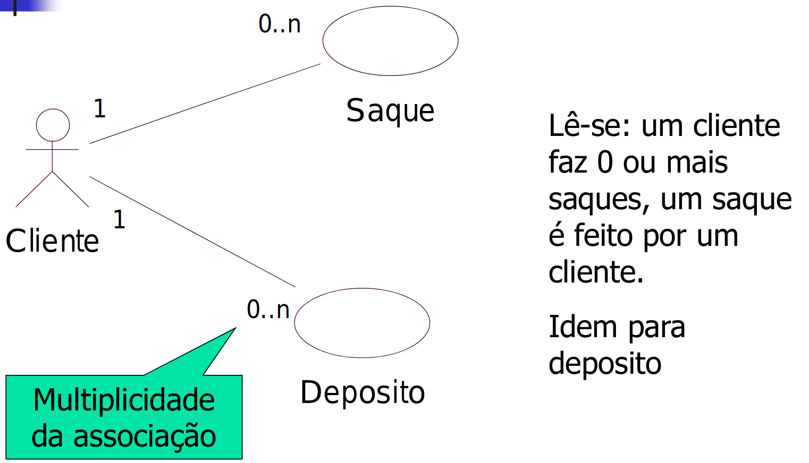

# Caso de uso

Vai ter um **ator**, que vai utilizar o sistema (não obrigatoriamente vai ser uma pessoa, mas pode ser um objeto tb - e.g. sensor de fumaça que chama os bombeiros, sei lá)

Um caso de uso é a utilização do *sistema* pelo *ator*. É, basicamente, uma funcionalidade do sistema - vai narrar a interação entre o sistema e os atores envolvidos.

```
    O             O         _________
   /|\ - - - - - /|\ - - - / vender  \
    |             |       (  produto  )
   / \           / \       \ ________/
 cliente      atendente
```

Muitas vezes é utilizado como um contrato entre desenvolvedor e cliente.

## Como identificar os atores

Observar os atores responsáveis por interações com o sistema.

- **Ator principal:** interage diretamente com o sistema computacional.

- **Ator secundário:** interage com outros atores.

## Como identificar os casos de uso

Analisar cada **requisito** do sistema - procurar grandes eventos que ocorrem e dão origem a uma interação entre um ator e o sistema.

> OBS: Colocar os nomes de caso de uso em verbo (emprestar livro, devolver livro, ...)

## Notação UML

> Ferramenta para utilizar: Astah Community

Leitor: desenha um homem palito, ou usa um esteriótipo: quadradinho com: <<ator>> Leitor dentro.

```
 O                 ______________
/|\               |   <<ator>>   |
 |        ou      |    Leitor    |
/ \               |______________|
leitor
```

Caso de uso: elipse

Associação: traço com seta ou não (tipo grafo, uni ou bidirecionado)

Para mostrar quantas vezes cada ator interage com cada caso de uso (não vai ser utilizado):



Heranças: seta ligando atores

**Se eu for fazer inclusão, alteração, consulta e exclusão, tenho que fazer vários casos de uso?**

- Usa-se o CRUD: *Create, read, update, delete*. Aí faz uma elipse só, e fica mais simples o diagrama.

## Caso de uso e PU

Exemplo nos slides

## Descrição dos casos de uso ou Casos de Uso textuais

### Formatos

#### Resumido

Resumo apenas com o cenário de sucesso principal

##### Completo

Várias sessões, completinho.

- Atores

- Interessados e interesses

- Pré-condições

- Pós-condições

- Cenário sucesso

- Sequências alternativas