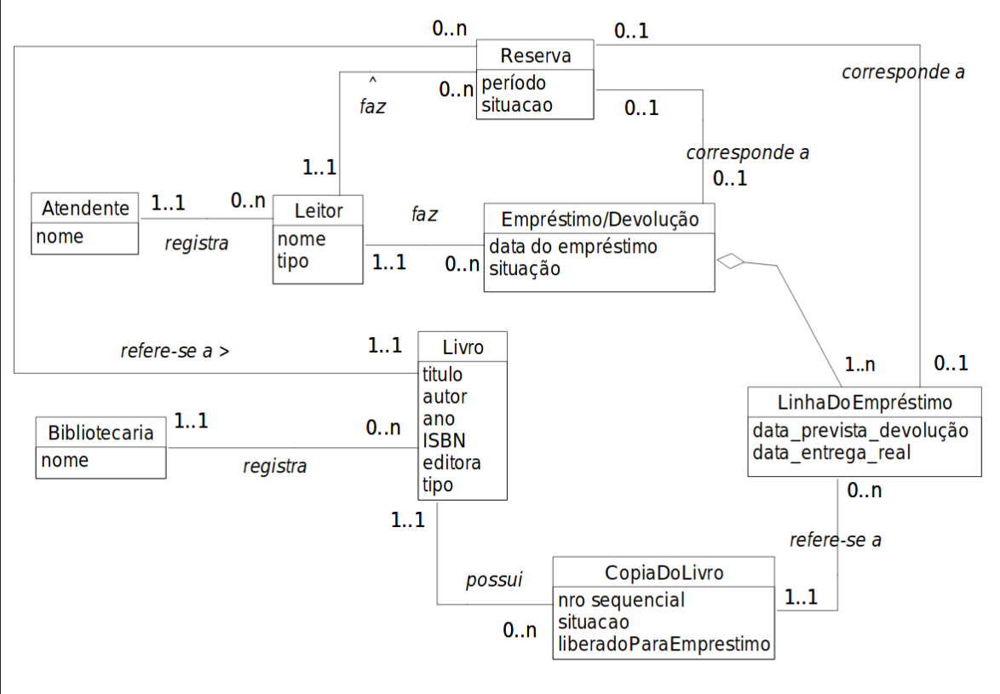
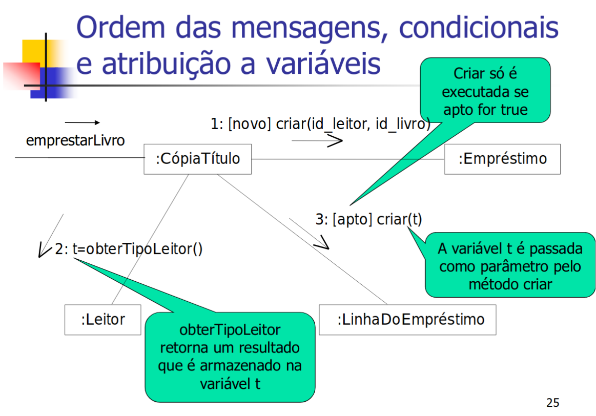
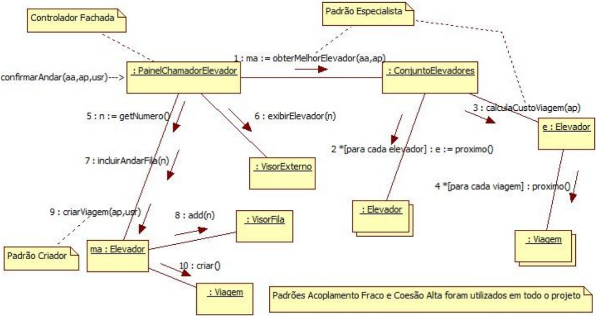
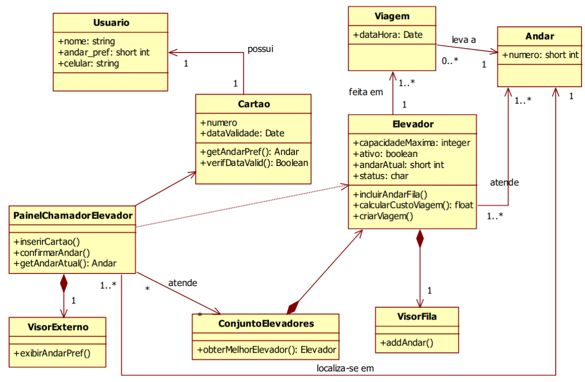

# APOO

## Modelo Conceitual

- Isole os substantivos;
- Verifique se é relacionado a assuntos importantes no domínio do sistema;
- Isole os verbos que podem ser transformados em substantivos;
- Para cada canditato, verifique se é composto de outras partes que sejam de interesse do sistema;
- OBS: `Sistema` não é conceito.
- Encontrar os *atributos* de cada conceito
- Encontrar as *associações* (relacionamentos) entre conceitos
- Multiplicidade de associações (1..n, *, 1,2,4)
- Associação reflexiva (+)
- **Herança** - *supertipo* ▻
- **Agregação** - incluir atributos ♦
- Obs: losango negro quando a multiplicidade do composto pode ser no máximo 1 (exemplo: automóvel ♦- roda)

## Diagrama de comunicação

## Padrões GRASP

Descrevem princípios funcamentais de atribuição de responsabilidade a objetos

- Especialista
- Criador
- Coesão alta
- Acoplamento fraco
- Controlador

### Especialista

Atribuir responsabilidade ao especialista, que conhece as coisas que tem que criar e tal

### Criador

Atribuir resposabilidade de uma classe criar uma instância de outra classe - porém, somente se agrega, contém, registra, possui ou usa objetos desta.

### Acoplamento

Mede o quanto um objeto está conectado, tem conhecimento ou depende de outros objetos

### Coesão

Mede o quanto as resposabilidades de um elemento são fortemente focalizadas e relacionadas

### Controlador

Quem deve ser responsável por tratar um evento do sistema. Deve ser :

#### Controlador fachada
Representa todo o sistema, dispositivo ou subsistema. Ex: biblioteca

### Controlador artificial
Represente um cenário de um caso de uso dentro do qual ocorra o evento. Ex: ControladorDeEmprestarLivro

## Diagrama de classe

### Visibilidade

Capacidade de um objeto ver ou fazer referência a outro. B será visível por A se:

- B é *atributo* de A
- B é *parâmetro* de um método de A
- B é *objeto local* de um método de A
- B é *global*

## Do projeto à implementação

Ordem: das classes com acoplamento mais baixo para as com acoplamento mais alto.

Só codar normalmente (atributos e métodos), tomando cuidado com as associações.

