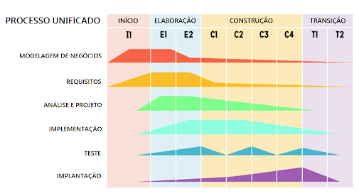

# Processo Unificado

- Lidando com mudanças

- Mudanças causam custos

- Possíveis soluções
  - Prototipação, entrega incremental

## Desenvolvimento de Protótipo

## Entrega Incremental
- Ciclo no desenvolvimento

## Modelo em Espiral
- Determina objetivos, avalia, desenvolve, planeja -> em cada fase, analisa riscos e faz protótipo

## PU

- Modelo de processo híbrido
  - Prototipação, incremental, iterativo

- Perspectivas diferentes
  - Dinâmica, estática e prática

- Fluxos de Trabalho para cada fase (requisitos, ...) -> porém, não é obrigado a fazer isso

- Cada fluxo tem um detalhamento...

