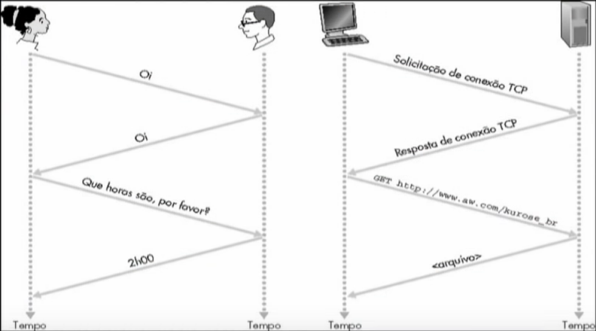

# Redes de computadores

Interligação de dois ou mais computadores e seus periféricos, com o objetivo de *comunicação*, *compartilhamento* e *intercâmbio* de recursos (como dados, arquivos, ...)

# Componentes

## Hardware

Computadores, smartphones, roteadores, switches, servidores, ...

## Software

TCP/IP, protocolos, e-mail, browser, ...

**Rede de computadores: conjunto de software e hardware**

# Internet

- Redes seria a "classe", e internet seria um "objeto", ou seja, a internet é uma implementação de uma rede.

- Elementos de computação interligados

- Enlaces (meios) de comunicação (fibra, rádio, satélite, ...)

# Protocolo

- Protocolo humano: que horas são? apresentações, ações tomadas...
- Protocolos de redes: toda atividade de comunicação da internet é governada por protocolos

## Definem regras que
- Estabelecem os formatos e a ordem das mensagens
- As ações a serem tomadas na transmissão e recepção das mensagens.



"Fala Erick"
"Fala Neidgel, beleza"
"beleza"
"...."


# Estrutura da Rede

## Borda da Rede

- aplicações e hospedeiros

### Tipos de serviços:

- Orientados à conexão (ex: telefonemas) - ex: TCP

- Sem conexão (ex: correspondência) - ex: UDP

Aplicações usando TCP: HTTP (Web), FTP (file transfer), SMTP (email), ...

- tem confirmação

Aplicações usando UDP: streaming media, teleconferência, telefonia IP, ...

- Software mais robusto fica na borda - google chrome não roda no núcleo

## Núcleo da Rede

- roteadores e rede de redes

"Servem para conectar um ponto a outro"

- múltiplos roteadores interconectados

### Formas de transferir dados na rede:

- Comutação de circuitos (usa um canal para cada conexão) - usa um canal dedicado desde o começo - ex: dirigir com uma rota fixa, definida no começo. Pode ser feita com FDM (frequência) e TDM (tempo).
*  * **Vantagens**: exclusividade, garante serviço
*  * **Desvantagens**: pode ser que alguém esteja reservando e não usando

- Comutação de pacotes (dados são enviados em "blocos" discretos) - ex: dirigir com mudança de rotas dinamicamente
*  * Cada fluxo é dividido em pacotes (cada pacote toma uma rota menos congestionada)
*  * **Vantagens**: pouco desperdício
*  * **Desvantagens**: alguns serviços podem ficar unitilizáveis

### Roteamento

#### Redes datagrama

- Endereço de destino determina o próximo salto
- Rotas podem mudar durante uma sessão
- Analogia: dirigir perguntando o caminho

#### Rede de circuitos virtuais

- Cada pacote leva um número (virtual circuit ID), o número determina o próximo salto
- O caminho é fixo e escolhido no instante de estabelecimento da conexão, permanece fixo durante toda a conexão.
- Analogia: dirigir já sabendo a rota

# Camadas

- Tipo módulos

Redes de computadores (OSI)

- Aplicação
- Apresentação
- Sessão
- Transporte
- Rede
- Enlace
- Física

Internet
				; pacote:
- Aplicação		; mensagem
- Transporte	; segmento
- Rede 			; datagrama
- Enlace 		; quadro/frame 		software ^
- Física							hardware


# Miscelânea

- ```netstat -o```

- colocar confiabilidade no UDP: camada de aplicação